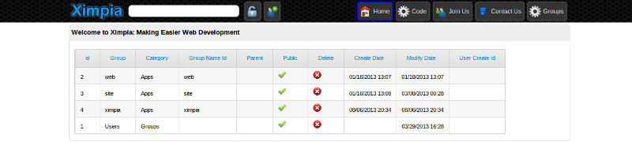
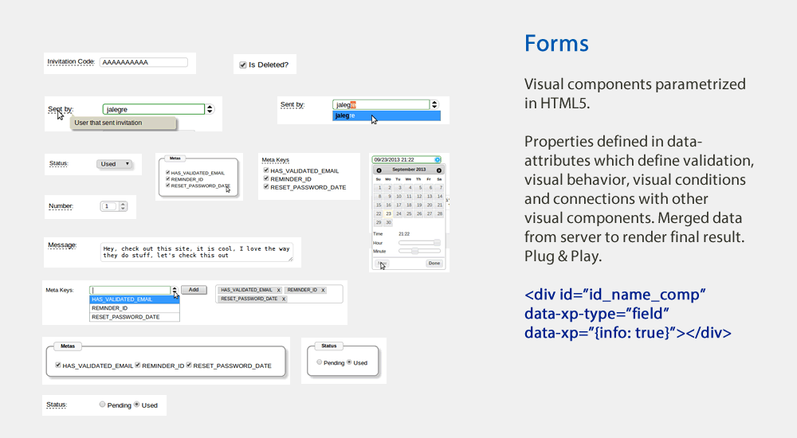

############
About Ximpia
############

Overview
========

Ximpia allows you to model back-end and front-end in an easy way to minimize lines of code for
your application.

On the front-end, you parametrize javascript components in HTML5 and define stylesheets to
customize look and feel.

On the back-end, you define your services (=use cases) with views, actions and app flow and 
other services like search, settings, parameters, already defined so you can speed up
development.

Views
=====

Views are called from menu items, search or other action components like buttons, links, etc...

They query your database and display information to your users, so framework uses slave databases for them. For example,
they would be list of customers, search customers and customer detail.

Views must all have a form which is defined in the decorator. Forms hold fields as well as window success messages and error 
messages.

In case you need to link views in a flow, you would set views into the workflow. You don't need to write code for this, all flow
logic is kept parametrized into the Workflow. You may write variables into the workflow and then define flows for views and actions
depending on variable data. Your services may write into workflow as well. It is easy to write wizards, use cases that link to other
use cases in a business operational flow.

.. code-block:: python

	@view(forms.HomeForm)
	def viewHome(self):
		db_setting = self._instances('ximpia.xpsite.data.SettingDAO')[0]
		# your code...

We have HomeForm with messages and fields for home view.

You would need to register the view, template, menu items and search for each view. In case you don't map views with menu, you can
skip menu registering::

	self._reg.registerView(__name__, serviceName='Users', viewName='login', slug='login', 
							className=SiteService, method='view_login')
	self._reg.registerTemplate(__name__, viewName='login', name='passwordReminder', winType='popup', 
						alias='password_reminder')
	self._reg.registerSearch(__name__, text='Login', viewName='login')

Forms
=====

Ximpia forms are a bit different from django forms since they keep database fields inyected into fields.

.. code-block:: python

	class LoginForm(XBaseForm):
		_XP_FORM_ID = 'login' 
		_dbUser = User()
		username = UserField(_dbUser, 'username', label='XimpiaId', required=False, 
			jsRequired=True, initial='')
		password = PasswordField(_dbUser, 'password', minLength=6, required=False, 
			jsRequired=True, initial='')
		socialId = HiddenField()
		socialToken = HiddenField()
		authSource = HiddenField(initial=K.PASSWORD)
		choices = HiddenField(initial=_jsf.encodeDict({'authSources': Choices.SOCIAL_NETS}))
		errorMessages = HiddenField(initial=_jsf.buildMsgArray([_m, ['ERR_wrong_password']]))
		okMessages = HiddenField(initial=_jsf.buildMsgArray([_m, []]))

We need ``_XP_FORM_ID`` to have an unique id used in front-end. Your forms in a service should have an unique id. When we build
form data for front-end, we use field attributes from model like maxlength, labels and helptext. You can customize these attributes
in the form class as well.

Actions
=======

Visual components associated with actions like buttons and links will call your actions. They may be called from search and menu items
as well.

Action operations may be mapped to your services. Each action would have an implementation associated with it in a method.

.. code-block:: python

	@validation()
	def _authen_user(self):
		if self._f()['authSource'] == K.FACEBOOK and self._f()['socialId'] != '':
			self._ctx.user = self._authenticate_user_soc_net(self._f()['socialId'], 
				self._f()['socialToken'], self._f()['authSource'], 'facebook', 
				_m.ERR_wrong_password)
		else:
			self._ctx.user = self._authenticate_user(self._f()['username'], 
				self._f()['password'], 'password', _m.ERR_wrong_password)

	@action(forms.LoginForm)
	def login(self):
		"""
		Performs the login action. Puts workflow parameter username, write context variables 
		userChannel and session.
		"""
		self._authen_user()
		self._login()
		user_channel_name = self._get_user_channel_name()
		self._dbUserChannel = UserChannelDAO(self._ctx_min)
		self._ctx.userChannel = self._dbUserChannel.get(user=self._ctx.user, 
			name=user_channel_name)
		self._ctx.session['userChannel'] = self._ctx.userChannel

You need to map form associated with the action using ``action`` decorator. Form is validated prior to processing action in decorator logic.

You can implement validation operations that need to be checked in order to execute your actions. You call them inside your action method 
(like ``self._authen_user()``). You can think of this as service-level validaations or business validations.

You would register them like::

	self._reg.registerAction(__name__, serviceName='Users', actionName='login', slug='login', 
		className=SiteService, method='login')

Templates and Visual Components
===============================

Ximpia templates are plain HTML5 files. You will find them at::

	myproject/myapp/templates

You will find your app directory with ``window`` and ``popup`` directories.

You will also find blank templates at your project path, built by ximpia ``ximpia-app`` script. You
would copy those blank templates and rename them in order to start with your own templates.

Here goes an example for change password popup:

.. code-block:: html

	<!DOCTYPE html>
	<html>
	<head>
	<meta http-equiv="Content-Type" content="text/html; charset=utf-8" />
	<title>Ximpia - Change Password</title>
	</head>
	<body>
	

	<!-- Content -->
	<section id="id_content" class="sectionContent">
	

	<form id="form_userChangePassword" action="" method="post" data-xp="{}">
	<!-- ximpiaId -->
	
 

	<!-- password -->
	

	<!-- newPassword -->
	

	<!-- newPasswordConfirm -->
	

	</form>
	

	 
	</section>
	<!-- Content -->
	<!-- Page Button Bar -->
	<section id="id_sectionButton" class="sectionButton">
	

	

	

	</section>
	<!-- Page Button Bar -->
	</body>
	</html>

``div`` elements with ``_comp`` ending in ``id`` hold the visual components. These visual
components will be parsed by our js rendering engine, build html5 and mix server data with
visual data.

Visuals for your application are built using what we call visual components. They are ``jQuery``
plugins that mix server data with parametrized data in HTML5 templates.

We provide a set of visual components tailored for most needs and you only need to parametrize
them in HTML5 templates. Most of the time, you will not need to develop js code, simply configure the
components with HTML5 ``data-`` attributes.

You can link your visual components and apply style themes.

In case this is not enough for you, you can write your own components. 

Example for list component:

.. code-block:: html

	
 
 

Will render as tabular data:

You have many components to choose from:

