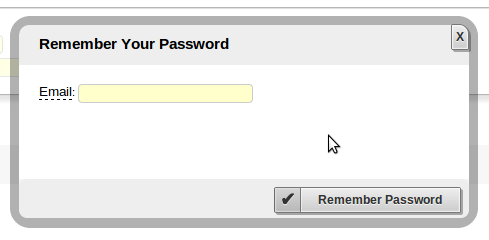

Example
=======

Here goes an example for remember password popup.

Model
-----

We use change password operations from default django User.

Visual Components
-----------------

Define components in template ``myproject/myapp/templates/xpsite/popup/password_reminder.html``:

.. code-block:: html

    

    <form id="form_password_reminder" action="" method="post" data-xp="{}">
    

    </form>
    

Email is field type with email validation. You include attributes in ``data-`` html5 attrs. Info
true allows the tool tip when mouse overs.

And this for the button:

.. code-block:: html

    <section id="id_sectionButton" class="sectionButton">
    

    

    

    </section> 

Form
----

.. code-block:: python

    class PasswordReminderForm(XBaseForm):
        _XP_FORM_ID = 'password_reminder'
        _dbUser = User()
        email = EmailField(_dbUser, 'email', label='Email', 
            helpText= _('Email address you signed up with'))
        errorMessages = HiddenField(initial=_jsf.buildMsgArray([_m, 
            ['ERR_wrong_password','ERR_email_does_not_exist']]))
        okMessages = HiddenField(initial=_jsf.buildMsgArray([_m, 
            ['OK_PASSWORD_REMINDER']]))

When we click change password button, ``OK_PASSWORD_REMINDER`` message would show. This message is included
in messages.py file.

View
----

.. code-block:: python

    @view(PasswordReminderForm)
    def view_password_reminder(self):
        """Show password reminder view"""
        pass

Action
------

Request password reminder will validate that email exists, generate reminderId, send email and return OK or error
message.

.. code-block:: python

    @action(forms.PasswordReminderForm)
    def request_reminder(self):
        """Checks that email exists, then send email to user with reset link
        """
        logger.debug('requestReminder...')
        self._dbUser, self._dbSetting, self._dbUserMeta, 
            self._dbMetaKey = self._instances(UserDAO, SettingDAO, UserMetaDAO, 
                MetaKeyDAO)
        self._validate_email_exist()
        # Update User
        user = self._dbUser.get(email = self._f()['email'])
        days = self._get_setting(K.SET_REMINDER_DAYS).value
        new_date = date.today() + timedelta(days=int(days))
        # Write reminderId and resetPasswordDate
        reminder_id = str(random.randint(1, 999999))
        metas = self._dbMetaKey.metas([K.META_REMINDER_ID, K.META_RESET_PASSWORD_DATE])
        self._dbUserMeta.save_meta(user, metas, {   
                                        K.META_REMINDER_ID: reminder_id, 
                                        K.META_RESET_PASSWORD_DATE: str(new_date)})     
        # Send email with link to reset password. Link has time validation
        xml_message = self._dbSetting.get(name__name='Msg/Site/Login/PasswordReminder/_en').value
        EmailService.send(xml_message, {    'home': settings.XIMPIA_HOME, 
                                        'appSlug': K.Slugs.SITE,
                                        'viewSlug': K.Slugs.REMINDER_NEW_PASSWORD,
                                        'firstName': user.first_name, 
                                        'userAccount': user.username,
                                        'reminderId': reminder_id}, settings.XIMPIA_WEBMASTER_EMAIL, 
                                            [self._f()['email']])
        logger.debug('requestReminder :: sent Email')
        self._set_ok_msg('OK_PASSWORD_REMINDER')

Registering
-----------

We register components so they work instantly with menu, command search, etc...

.. code-block:: python

    self._reg.registerView(__name__, serviceName=Services.USERS, 
        viewName=Views.REMINDER_NEW_PASSWORD, slug=Slugs.REMINDER_NEW_PASSWORD, 
        className=SiteService, method='view_reminder_new_password')
    self._reg.registerTemplate(__name__, viewName=Views.REMINDER_NEW_PASSWORD, 
        name=Tmpls.REMINDER_NEW_PASSWORD)
    self._reg.registerAction(__name__, serviceName=Services.USERS, 
        actionName=Actions.REQUEST_REMINDER, slug=Slugs.REQUEST_REMINDER,
        className=SiteService, method='request_reminder')

We trigger view with a link, so we don't need menu or search components.
