Visual Components
=================

Common Attributes
-----------------

* ``class`` : Will add all classes in this field
* ``tabindex`` : Will include tabindex support for entry fields with sequence when hitting tab key.
* ``readonly`` : Component will be read-only.
* ``maxlength`` : Maximum length for entry components.
* ``value`` : Value.
* ``name`` : Name of component

Button
------

This component shows in top and bottom bars of views. The actions are mapped with ximpia actions to produce validation. Validation
results will be shown in message that slides up from button or popup window.

Html
""""

Save button:

.. code-block:: html

    
 

Attributes
""""""""""

* ``form`` : The form id associated with the action
* ``align`` : left | right
* ``text`` : Button text, without multi-language. English only
* ``mode`` : actionMsg | action | closePopup | closeView | contentInsert
* ``action`` : Action that executes the button
* ``type`` : color | icon | iconPopup | simple
* ``icon`` : add | edit | delete | save | email | like | next | star | spark | play
* ``callback`` :  The callback function to execute after button is clicked
* ``title`` [optional] : Tooltip for button
* ``titleDisabled`` [optional] : Title to show when state is disabled
* ``clickStatus`` : disable : Button status when button has been clicked and action processed.

Interfaces
""""""""""

* ``IAction``

Methods
"""""""

* render
* click
* disable
* enable
* unrender

Check
-----

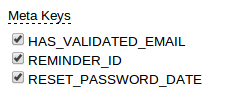

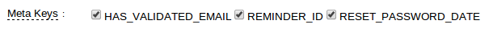

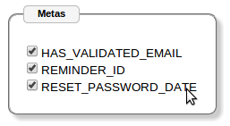

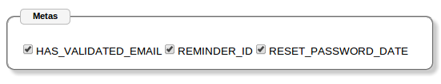

List of options with ``checkbox`` render. Allows horizontal or vertical render of list of entries. Checkbox can
be placed before or after the field entry and labels can be at top or left.

Html
""""

.. code-block:: html

    
 

Attributes
""""""""""

* ``label`` : Label
* ``size`` : Input box size
* ``helpText`` : Tooltip to show
* ``info`` : Weather to show tooltip.
* ``labelWidth`` : Width for label
* ``alignment`` [optional] : 'vertical', 'horizontal'
* ``hasLabel`` [optional] : "true" or "false". Weather to show or not a label, at left or top of check controls.
* ``labelPosition`` [optional] : 'top'|'left'. Label position, left of check buttons, or top for label at one line and check
                                 controls on a new line.
* ``controlPosition`` [optional] : 'before'|'after'. Default: 'before'. Position for the check control, after or before text.

Interfaces
""""""""""

* ``IInputList`` : Interface for list of entries

Methods
"""""""

* ``render`` : Render
* ``enable`` : Enable
* ``disable`` : Disable
* ``unrender`` : Reset

Container
---------

Set of visual components.

Supports conditions. You can place your visual objects inside containers to force condition for rendering.
 
Conditions are defined in the view definitions with attribute ``data-xp-cond-rules``, like:

.. code-block:: html

    

    

 

Html
""""

.. code-block:: html

    

          ...your objects...
          
 

    

Attributes
""""""""""

* ``data-xp-type`` : container
* ``data-xp-cond`` :ListType : Condition objects, like [{}, {}, ...] First matched condition will execute action
      * ``conditions`` :ListType : List of conditions:
         * ``condition`` : condition key from ``data-xp-cond-rules``
         * ``action`` : Supported values: 'render'
         * ``value`` :Boolean : true / false

Content
-------

Allows to embed server-side data into templates.

Inserts into templates data from visual context. If you have ``form_mine`` and want to refer field ``name``, you would:

.. code-block:: html

    {{form_mine.name}}

You can also add objects to your visual context from server-side in your services:

.. code-block:: python

    self._add_attr('customer', customer)

Where customer may be any serilizable object.

and you would:

.. code-block:: html

    {{customer.name}}

To display customer name.

Html
""""

.. code-block:: html

    <a href="{{object.url}}" title="{{object.title}}" data-xp-type="content" >{{object.title}}</a>

We would have ``object`` in our visual context.

Field
-----

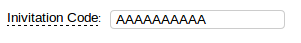

Field with formatting option and tooltip with ``helpText`` attribute. Option to provide auto-complete
from choices or server-side data.

Html
""""

.. code-block:: html

    
 

Attributes
""""""""""

* ``label`` : Label
* ``size`` : Input box size
* ``helpText`` : Tooltip to show
* ``info`` : Weather to show tooltip.
* ``labelWidth`` : Width for label

Attributes for auto-completion choices
""""""""""""""""""""""""""""""""""""""

* ``choicesId`` : Choices id to reference to show list.
* ``choiceDisplay`` [optional] default:value : name|value. Display either name or value from choices.
* ``maxHeight`` [optional] : Max height of autocomplete box
* ``minCharacters`` [optional] : Min characters to trigger auto-complete box.

Attributes for auto-completion server-side
""""""""""""""""""""""""""""""""""""""""""

* ``app`` [optional] : Application code
* ``dbClass`` : Data class to show results from.
* ``searchField`` :String : Search field to match for text from input field.
* ``maxHeight`` [optional] : Max height of autocomplete box
* ``minCharacters`` [optional] : Min characters to trigger auto-complete box.
* ``params`` [optional] :Object : Parameters to filter completion list.
* ``fieldValue`` [optional] :String : Field to show results. In case not defined, will use the model string representation.
* ``extraFields`` [optional] :List : Fields to show in extra Object

methods
"""""""

* ``render`` : Renders the component
* ``complete`` : Bind autocomplete behavior
* ``enable`` : Enable field
* ``disable`` : Disable field
* ``unrender`` : Reset (remove) component data and remove ``data-xp-render`` attribute.

FieldCheck
----------

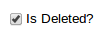

Renders fields that are BooleanField, with values true / false or 1 for true and 0 for false

Support labels. Check control can be before label or after.

Html
""""

.. code-block:: html

    
 

The above code will just show a checkbox with True/False logic. You can include label as well.

This case would show checkbox and a message after the box to agree to terms and conditions in a web site:

.. code-block:: html

    
 

Attributes
""""""""""

* ``label`` [optional] : Label
* ``helpText`` [optional] : Tooltip to show at label
* ``info`` [optional] : Weather to show tooltip at label.
* ``labelWidth`` [optional] : Width for label
* ``controlPosition`` [optional] : 'before'|'after'. Default: 'before'. Position for the radio control, after or before text.

Interfaces
""""""""""

* ``IInputField`` 

Methods
"""""""

* ``render`` : Render
* ``enable`` : Enable
* ``disable`` : Disable
* ``unrender`` : Reset

FieldDateTime
-------------

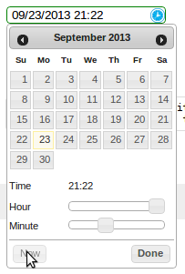

* Date and Time field representation. This component renders form fields Date, DateTime and Time.

* When field type is Date, a date tooltip will popup to select date.

* When field type is Time, a time tooltip will popup to select time with two selection bars for hour and minute.

* When field type is DateTime, a date with time tooltip will show up with calendar and time bars.

Html
""""

.. code-block:: html

    
 

Type can be ``field.datetime``, ``field.date`` or ``field.time``.

Attributes
""""""""""

* ``label`` [optional] : Label
* ``helpText`` [optional] : Tooltip to show at label
* ``info`` [optional] : Weather to show tooltip at label.
* ``labelWidth`` [optional] : Width for label
* ``hasLabel`` [optional]
* ``labelPosition`` [optional]

FieldList
---------

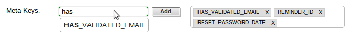

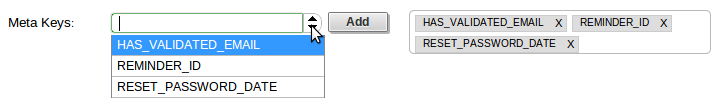

List of fields. Fields can be added and deleted. Can represent the many-to-many relationships in models. 
 
They can be rendered as tags horizontally.

Html
""""

Input: 

.. code-block:: html

    
 

Select:

.. code-block:: html

    
 

Attributes
""""""""""

* ``type``:string [default: field] [optional] : Type of control for adding values: ``field`` and ``select.plus`` possible values.
* ``labelWidth``:string [optional]
* ``selectObjId``:string [optional]
* ``modelField``:string [optiona] : For field input type, the model field value. Required for fields. Not required for select input.
* ``choicesId``

Interfaces
""""""""""

* ``IInputList``
* ``IKeyInput``

Methods
"""""""

* ``render`` : Render.
* ``keypress`` : Deals with ``Enter`` key stroke and adding clicked to list of entries.
* ``enable`` : Enable
* ``disable`` : Disable
* ``unrender`` : Reset

FieldNumber
-----------

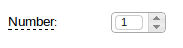

Html
""""

.. code-block:: html

    

Attributes
""""""""""

* ``label`` : Label
* ``size`` : Input box size
* ``helpText`` : Tooltip to show
* ``info`` : Weather to show tooltip.
* ``labelWidth`` : Width for label
* ``hideSpinner`` :Boolean : Hides spinner control

Interfaces
""""""""""

* ``IInputField``

Methods
"""""""

* ``render`` : Render
* ``enable`` : Enable
* ``disable`` : Disable
* ``unrender`` : Reset

Function
--------

Allows to render content based on a javascript function.

Html
""""

.. code-block:: html

    
 

You can add attributes to ``data-xp`` and refer to those in your javascript function.

Your javascript function would be like:

.. code-block:: javascript

    ximpia.external.Facebook.renderSignup = (function(attrs, callable) {
        // Code
    }

``attrs`` are the attributes from ``data-xp`` html attribute.

Attributes
""""""""""

* ``functionName`` : Path to javascript function name

Any additional attributes you define

Link
----

Hyperlink which would trigger a new view or call an action.

Links used to:

1. Launch views (new and popups) - launchView
2. Open popups (openPopup) - openPopup
3. Launch actions - doAction
4. Link to url - callUrl
 
Types are:

* ``link.popup``
* ``link.url``
* ``link.view``
* ``link.action``

Html
""""

.. code-block:: html

    

.. code-block:: html

    

.. code-block:: html

    

Attributes
""""""""""

* ``class``
* ``textSize``

Interfaces
""""""""""

* ``IAction``

Methods
"""""""

* render
* click
* disable
* enable

ListContent
-----------

You include a div for the component definition and html inside this div can be any html element that will
be repeated for each row in the list. You include data with {{}} notation. Response context has elements for lists
with ``list_myList``where myList relates to ``id_myList_comp``. This way you don't have to repeat {{list_myList.data.myField}} and only
need to include {{data.myField}}. You can include list values, header values and meta values for the list.

You can include any element in three positions: jxListContentHeader, jxListContentBody and jxListContentFoot. Body position will incude
the rows to be repeated in the list with values. Header will include content before list and foot includes any content you need at end
of list.

.. code-block:: html

    
 
    <$htmlElement class="jxListContentHeader">
    Here go the results...
    </$htmlElement>
    <$htmlElement class="jxListContentBody">
    {{header.myField}}: {{data.myField}}
    </$htmlElement>
    <$htmlElement class="jxListContentFoot">
    numberPages: {{meta.numberPages}}
    </$htmlElement>
    

Example:

.. code-block:: html

    
    
    

         These are the results you will have...  
    

    

         {{headers.group__name}}: {{data.id}} - {{data.group__name}}     
    

    

         Number pages: {{meta.numberPages}}  
    

    

    

        More Results...
    
   
    

Attributes
""""""""""

* ``dbClass`` :string
* ``app`` :string [optional]
* ``method`` :string [optional] [default:searchFields] : Data method to execute
* ``fields`` :object<string>
* ``args`` :object [optional] : Initial arguments. Object with arguments
* ``orderBy`` :object [optional] : Order by fields, ascending with '-' sign before field name. Supports relationships, like 'field__value' 
* ``disablePaging`` :boolean [optional] [default: false]
* ``pagingStyle`` :string [optional] [default:more] : Possible values: more

Interfaces
""""""""""

* ``IList``
 
Methods
"""""""

* ``render``
* ``insertRows`` (xpForm:string, result:object) : Inserts rows into content list.

ListData
--------

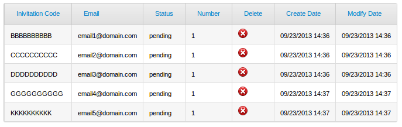

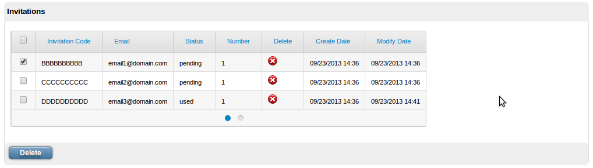

Check out images for PagingMore and PagingBullet for ListData paging support.

Html
""""

.. code-block :: html

    
 

Attributes
""""""""""
* ``dbClass`` :string
* ``app`` :string [optional]
* ``method`` :string [optional] [default:searchFields] : Data method to execute
* ``detailView`` :object [optional] <viewPath, winType>: View to display detail. hasLinkedRow must be true. Full path, like 'myProject.myApp.myView'. winType can be ``window``or ``popup``
* ``detailType`` :string [optional] [default:window] : Window type: window, popup.
* ``fields`` :object<string> [optional]
* ``args`` :object [optional] : Initial arguments. Object with arguments
* ``orderBy`` :object [optional] : Order by fields, ascending with '-' sign before field name. Supports relationships, like 'field__value' 
* ``disablePaging`` :boolean [optional] [default: false]
* ``caption`` :string [optional]
* ``headComponents`` :object [optional] : List of header components. Possible values: search|filter
* ``hasCheck`` :boolean [optional] : Table has operations linked to row checks. User would check rows and click button to execute actions on checked items.
* ``activateOnCheck`` :object : List of components to activate when row check is clicked.
* ``onCheckClick`` :string [optional] [default:enable] . Enable or render action components when user clicks on check.
* ``hasHeader`` :boolean [optional] [default:true]
* ``pagingStyle`` :string [optional] [default:more] : Possible values: more, bullet
* ``pagingMoreText`` :string [optional] [default:More Results...] : More paging text
* ``hasLinkRow`` :boolean [optional] [default:false]

Build Attributes
""""""""""""""""
 
* ``pageStart``
* ``pageEnd``
 
Interfaces
""""""""""
 
 * IList 
 
Methods
"""""""

* ``render``
* ``insertRows`` (xpForm:string, result:object) : Result contains keys data, headers and meta for list result

Image
-----

Renders into ``img`` html element.

``src`` html attribute is generated using attributes ``file``, ``location`` and ``hostLocation``. Only required attribute is ``file``. You
can define ``src`` attribute with full path for images. 

Html
""""
 
By class:

.. code-block:: html

    
 

 
Using images location and default host location:

.. code-block:: html

    
 

Using S3 host location:

.. code-block:: html

    
 

Using cloudfont host location:

.. code-block:: html

    
 

Using src:

.. code-block:: html

    
 

Attributes
""""""""""

* ``imgClass`` : Image file name is blank.png. Image has background from css class.
* ``file`` : Phisical file name with extension, like ``myphoto.png``. In case version attribute is defined, phisical file name will be modified to include version in the url. In case src is defined, this field is not required.
* ``location`` [optional] : Location name. Locations are mapped into settings.js file. In case no location is defined, we use ``images`` location. Locations are mapped into paths.
* ``src`` [optional] : In case you want to define path instead of location. In case you have path, you don't need attributes file, location or hostLocation.
* ``hostLocation`` [optional] : Host location mapping to use. You can define in settings alternate host location for your images, like ximpia.settings.hostLocations['S3'] = 'https://ximpia.s3.amazonaws.com/'. In case not defined, will use the default host location. This way for images can point to S3, local, cloudfront, etc...
* ``title`` : Tooltip to show when mouse is placed over image.
* ``version`` [optional] : Version to generate url for image versions. In case to include version you need no ``dimensions``attribute. Dimensions from version will be used.

Option
------

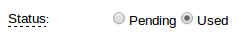

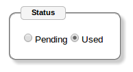

.. image:: ../images/option-block-vertical.png

You can have options integrated into ``fieldset`` html element or having labels. You have the option of horizontal or vertical
layout with labels on left or top.

In case you select ``type: 'check'`` you would see a list of checkboxes. But they will behave like options, only one can be checked.
This has advantage that no entries can be checked by default and you can check uncheck the last option if you wish, having feature
to reset the option list.

Html
""""

.. code-block:: html

    
 

Attributes
""""""""""

* ``type`` : 'radio', 'check' default 'radio'
* ``alignment`` [optional] : 'vertical', 'horizontal'. Default. horizontal.
* ``hasLabel`` [optional] : "true"|"false". Weather to show or not a label, at left or top of radio controls.
* ``label`` [optional] : Field label
* ``labelPosition`` [optional] : 'top'|'left'. Label position, left of radio buttons, or top for label at one line and radio
                                  controls on a new line. Default ``left``
* ``controlPosition`` [optional] : 'before'|'after'. Default: 'before'. Position for the radio control, after or before text.
* ``info`` [optional] : Displays tooltip with helpText field data.

Interfaces
""""""""""

* ``IInputList``

Types
"""""
* ``radio`` : radio option box
* ``checkbox`` : check box. Behaved like option, when user clicks on one, it gets selected. Ability to have no option cheched. Good for many relationships with null=true.

Methods
"""""""

* ``render``
* ``disable``
* ``enable``

PagingBullet
------------

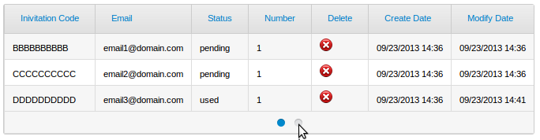

Bullet paging component which displays current page, next n (customized, default 5) pages with ability to jump to pages.  

Current page has filled bullet. When mouse goes over, shows number of resources to fetch (1-10).

ContentList
"""""""""""

Gets integrated into the ``jxListContentFoot``:

.. code-block:: html

    

        
 
   
    

DataList
""""""""

* pagingStyle: 'bullet'
* numberResults: 3
* numberPages: 2

Attributes
""""""""""
 
* ``compId`` :string : Id for list component
* ``numberPages`` :number : Number of pages for list
* ``numberResources`` :number : Number of resources in the list, used to display result pointers in page links (1-10, etc...)

Interfaces
""""""""""

* IPage

PagingMore
----------

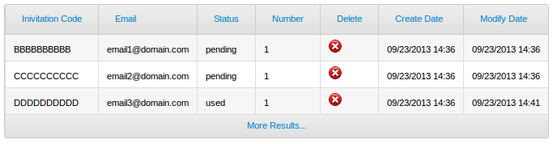

Paging with ``More`` link. AJAX call will populate next page.

ListContent
"""""""""""

Gets integrated into the ``jxListContentFoot``:

.. code-block:: html

    

        

            More Results...
        
   
    

ListData
""""""""

* pagingStyle: 'more'

Select
------

.. image:: ../images/select.png

Html
""""

.. code-block:: html

    
 

Attributes
""""""""""

* ``label`` : Label
* ``size`` : Input box size
* ``helpText`` : Tooltip to show
* ``info`` : Weather to show tooltip.
* ``labelWidth`` : Width for label

Interfaces
""""""""""

* ``IInputField``

Methods
"""""""

* ``render``
* ``disable``
* ``enable``
* ``unrender``

SelectPlus
----------

.. image:: ../images/combo.plus.png

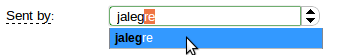

Html
""""

.. code-block:: html

    
 

Choices from server-side form field is used by default. You may include field attribute ``choicesId`` in the properties
to modify defult value.

As you type text, auto-complete will drop under to help you on selection. For cases withmany entries you will have paging
support on entry list to browse on different pages of results, very handy for big lists.

When you have ``hasBestMatch`` the best match is highligted and selected in the input box. So when you start typing in a country
list "Spa", when best match is Spain will automatically get selected in the text box.

Attributes
""""""""""

* ``label`` : Label
* ``size`` : Input box size
* ``helpText`` : Tooltip to show
* ``info`` : Weather to show tooltip.
* ``labelWidth`` : Width for label
* ``hasBestMatch`` :String : Highlight best match relative to field text. Default true.
* ``gmaps`` : Google maps association, like 'country'. Used for list of countries. Google maps library will set country based on location.
* ``choicesId`` : Id for choice list.

Interfaces
""""""""""

* ``IInputField``

Methods
"""""""

* ``render``
* ``setValue`` : Sets value in selection box
* ``disable``
* ``enable``
* ``unrender``

TextArea
--------

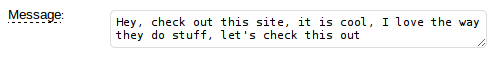

When you set ``isCollapsible: true``, as you type and get to end of row, a new row will be added to text area. This way you
don't need to size text box and size adapts to size user needs to write. You may start with one or two lines, and as users type,
end up with more lines.

Html
""""

.. code-block:: html

    
 

Attibutes
"""""""""

* ``label`` : Label
* ``size`` : Input box size
* ``helpText`` : Tooltip to show
* ``info`` : Weather to show tooltip.
* ``labelWidth`` : Width for label
* ``cols``
* ``rows``
* ``isCollapsible``

Interfaces
""""""""""

* ``IInputField``

Methods
"""""""

* ``render``
* ``disable``
* ``enable``
* ``unrender``
