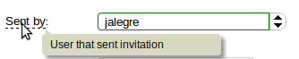

.. Ximpia documentation master file, created by
   sphinx-quickstart on Tue Jan 29 00:12:11 2013.
   You can adapt this file completely to your liking, but it should at least
   contain the root `toctree` directive.
.. |ximpia| replace:: Ximpia

Ximpia
======

What is Ximpia?
---------------

.. toctree::
   :maxdepth: 2
   
   about

.. toctree::
   :maxdepth: 1

   example

Installation & Setup
--------------------

.. toctree::
   :maxdepth: 2
   
   quickstart

Server Side
-----------

You start by defining your views and actions in your services using forms as way to map database fields to visual objects:

.. code-block:: python

    class MyForm(XBaseForm):
        _XP_FORM_ID = 'customer_detail'
        [... your fields with db instances inyected ...] 
        errorMessages = HiddenField(initial=_jsf.buildMsgArray([_m, ['ERR_my_error_message']]))
        okMessages = HiddenField(initial=_jsf.buildMsgArray([_m, ['success']]))

.. code-block:: python

    class MyService(CommonService):

        @view(forms.MyForm)
        def view_customer_detail(self):
            # Logic to get customer detail...

Your data layer with common operations (can extend data operations)::

    class MyDAO(CommonDAO):
        model = MyModel

And you register components to allow search, menu, workflow and other components consistency::

    self._reg.registerView(__name__, serviceName='MyService', viewName='customer_detail', slug='customer-detail', 
                            className=SiteService, method='view_customer_detail')
    self._reg.registerTemplate(__name__, viewName='customer_detail', name='customer_detail')

.. toctree::
   :maxdepth: 1

   server-side/service
   server-side/business
   server-side/data
   server-side/models
   server-side/workflow
   server-side/fields
   server-side/menu
   server-side/registry
   server-side/commands
   server-side/xpsite

Front-End
---------

You define visual components as ``div`` elements in plain HTML5 template files:

.. code-block:: html

    
 

This allows your web development to be plug&play: Simply define properties for your visual objects and paste into
html5 templates.

.. toctree::
   :maxdepth: 3

   front-end/conditions
   front-end/visual-components
   front-end/templates
   front-end/menu
   front-end/search

Release Notes
-------------

.. toctree::
   :maxdepth: 2

   release-notes

Contributing
------------

.. toctree::
   :maxdepth: 2

Best way to contribute is to help us with visual components already identified and under development or
provide your own visual components to be included in our releases.

You can check our visual components at GitHub: `Visual Components`_

.. _Visual Components: https://github.com/Ximpia/ximpia/issues?labels=visual+comp.&page=1&state=open

To contribute send us a message
https://ximpia.com/contact-us

Code
----

https://github.com/Ximpia/ximpia/

Website
-------

https://ximpia.com
