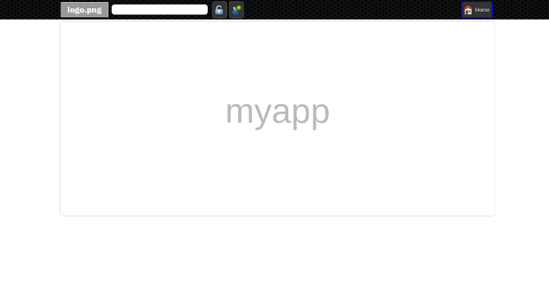

Quick Start
===========

Virtual Environment
-------------------

Create and activate virtual environment::

	mkdir envs
	virtualenv envs/ximpia-env
	source envs/ximpia-env/bin/activate

Installation
------------

Using ``pip``::

	pip install ximpia

This will install ximpia and required packages:

* Grappelli
* Filebrowser
* South

Go to https://github.com/Ximpia/ximpia/ if you need to download a package or clone the repo.

Setup Application
-----------------

To start your application, type::

	ximpia-app myproject.myapp

It will create folders and files needed for your application in ximpia. It will prompt for
basic information like database connection user, admin name and password and locale.

Creates and registers your application home view.

Then you only need to go to directory for your project::

	./manage.py runserver

And open your browser at ``http://127.0.0.1:8000/``:

Customize your logo at ``myproject/myproject/myapp/static/images/logo.png``.

You are set to develop your app: views, actions, etc...
